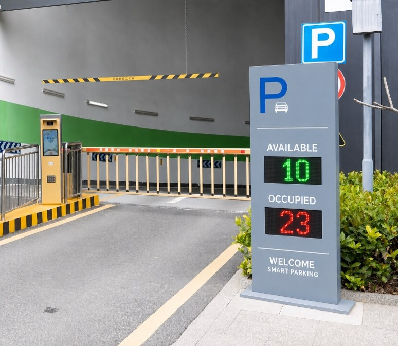
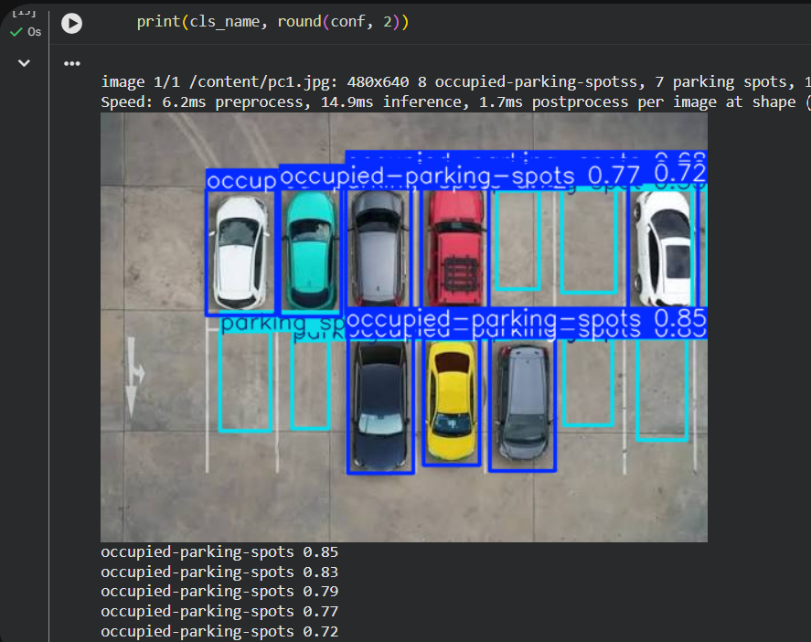

# Smart Parking System

A system that automatically detects empty and occupied parking spots using cameras and AI, and shows the live count on a display screen at the parking entrance.

## Project Overview

The Smart Parking System aims to make it easier to find an available parking spot and reduce congestion inside parking lots. The system uses cameras and AI to monitor parking spots and determine whether each one is empty or occupied, then displays the number of available spots live on a screen at the parking entrance.

## The Problem

During peak hours, drivers spend a long time searching for a parking spot, which leads to:

- Increased congestion inside the parking lot
- Wasted time and fuel
- Difficulty tracking parking availability

## Proposed Solution

The system continuously monitors all parking spots and classifies each one as:

-  Empty
- Occupied

The number of available and occupied spots is then shown on a screen at the parking entrance, so drivers know the parking status before entering — reducing unnecessary movement inside the lot.

## Current Project Status

-  **Detection model (YOLOv8) is trained and ready** — trained on real parking data, and accurately distinguishes empty from occupied spots (mAP50 ≈ 0.97).
-  **The physical display device at the security gate has not been built or installed yet** — there is currently no real camera or device connected to the model.
-  **Next step:** install a real camera in the parking lot, connect it to the trained model, then set up an actual display device that receives the results and shows them live.

## Examples

**1. Target design for the display device (reference only — not yet implemented)**




> This is a reference image showing the intended final look of the display device at the security gate. The physical device has not been installed yet — building it is part of the next step, after connecting the model to a real camera.

**2. Real detection result from the trained model**


> This is an actual result from the trained YOLOv8 model, showing its ability to distinguish occupied spots (blue) from empty spots (cyan) with high confidence on a real parking lot image.

## Benefits (once fully implemented)

- Reduces congestion inside parking lots
- Saves drivers time and effort
- Improves the user experience
- Leverages AI to provide a modern, smart solution for parking management

## File Structure

```
├── best.pt              # Trained model weights
├── parking.ipynb         # Training notebook (Google Colab)
├── images/
│   ├── display-example.jpg   # Reference for the target display device
│   └── model-output.jpg      # Real detection result from the model
└── README.md
```

---
**Fatima Alibrahim**
